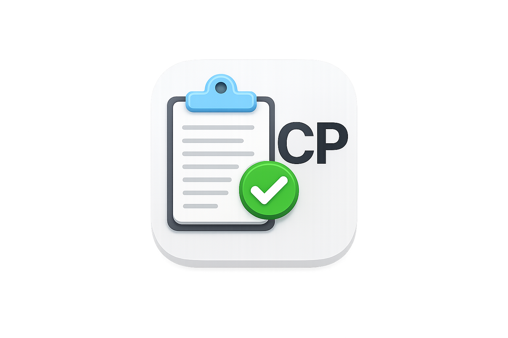

<p align="center">
  
</p>

<h1 align="center">CleanPaste</h1>

<p align="center">
  A tiny macOS menu bar app that cleans messy text copied from PDFs.
</p>

<p align="center">
  <a href="https://raw.githubusercontent.com/Nurikexe/CleanPaste/main/dist/CleanPaste-1.1.dmg">
    
  </a>
</p>

## Install

1. Click the **Download** button above.
2. Open `CleanPaste-1.1.dmg`.
3. Drag `CleanPaste.app` into `Applications`.
4. Launch CleanPaste from Applications, Spotlight, or Launchpad.

CleanPaste appears in the macOS menu bar. It does not open a normal window.

## Use

1. Copy text from a PDF.
2. Click the CleanPaste icon in the menu bar.
3. Click `Clean Clipboard`.
4. Paste the cleaned text anywhere.

CleanPaste replaces your clipboard text with the cleaned version.

## What It Fixes

- Words split by PDF line breaks
- Broken lines inside paragraphs
- Extra spaces
- Spaces before punctuation
- Paragraph breaks

Example:

```text
We'd be over-
whelmed with an avalanche of thoughts and emotions.
We'd have too
much data.
```

Becomes:

```text
We'd be overwhelmed with an avalanche of thoughts and emotions. We'd have too much data.
```

## For Developers

Build a new DMG:

```bash
./scripts/package_release.sh
```

Output:

```text
dist/CleanPaste-1.1.dmg
```

The app icon comes from `Icon.png`.

Note: this app is locally signed. For a public macOS release without Gatekeeper warnings, sign it with an Apple Developer ID certificate and notarize it with Apple.
